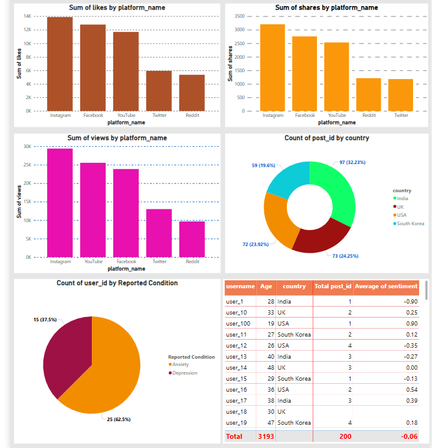

# 📊 Social-Media-Trend-Analysis 
This project features a Social Media Trend Analysis Dashboard developed using Microsoft Power BI with data sourced from a PostgreSQL database. Complex SQL queries were used to generate datasets capturing trending hashtags, user behaviors, sentiment analysis, and mental health impact from social media platforms.

## 📁 Dataset
The dataset is structured in multiple relational tables stored in PostgreSQL (or Excel) including:
- **Users**: User information such as user ID, name, country, age, and platform used
- **Posts**: Social media posts with post ID, user ID, content, timestamp, and platform ID
- **Hashtags**: Hashtag IDs and corresponding hashtag text
- **Post_Hashtags**: Mapping table linking posts and hashtags (post ID, hashtag ID)
- **Platforms**: Social media platforms like Twitter, Instagram, Facebook with platform ID and name
- **Sentiments**: Sentiment analysis results for posts, including sentiment category and score
- **Mental_Health_Impact**: Flags for reported anxiety or depression linked to user IDs

## 📌 Key Dashboard Features
- Data modeling with multiple normalized tables connected via one-to-many relationships for efficient analysis.

- SQL queries in PostgreSQL used to extract, aggregate, and prepare data for visualization.

- Interactive Power BI dashboard showing hashtag popularity, sentiment trends, user engagement, and mental health insights.

- Dynamic filters and slicers for platform, country, date range, and sentiment/mental health categories.

## 📎 Tools Used
- **PostgreSQL** for data storage, querying, and preprocessing.
- **Microsoft Power BI** for visualization and dashboard creation.

## ✅ How to Use
1. Run the provided SQL scripts in **PostgreSQL** to create and populate the necessary tables.
2. Connect **Power BI** to the **PostgreSQL database** using the appropriate credentials.
3. Load the data into **Power BI** and open the dashboard report `.pbix` file.
4. Use slicers and filters within the dashboard to explore social media trends interactively.

---

